# Test Report & Comparative Analysis: Cortex Update Lifecycle

- **Date:** 2026-09-08
- **Evaluator / Client:** opencode (kenari)
- **Model Under Test:** `glm-5.3-flash`
- **Evaluation Task:** Deep Architecture Tracing — `cortex update` End-to-End Lifecycle
- **Test Prompt:**
  > *"Explain the end-to-end lifecycle when a user runs cortex update. Trace how files are scanned, hashed, parsed by Tree-sitter, and transactionally replaced in SQLite. Specify the exact functions involved, their file paths, and why unchanged files are skipped."*

---

## 1. Executive Summary & Head-to-Head Metrics

| Metric | With Cortex (`cortex context`) | Baseline (Without Cortex) | Delta / Impact |
| :--- | :--- | :--- | :--- |
| **Total Turn Latency** | **1m 49s (109s)** | **2m 50s (170s)** | **-61s (-35.9% faster)** |
| **Generation Speed** | **47.5 tok/s** | **44.6 tok/s** | **+6.5% tok/s** |
| **Total Tokens** | **28,707 tokens** | **25,793 tokens** | **+2,914 tokens (+11.3%)** |
| **Architecture Discovery** | **Immediate entry points** | **Trial-and-error discovery** | Zero cold-start disorientation |
| **Technical Accuracy** | **100% (Line-level exact)** | **100% (Line-level exact)** | Both produced exceptional depth |

---

## 2. Key Findings & Observations

### 2.1 Latency & Reasoning Speed: Cortex Saved Over 1 Minute (36% Faster)
* **With Cortex:** Completed in **1m 49s**.
* **Without Cortex:** Took **2m 50s**.
* **Why:** Without Cortex, the agent spent prolonged thinking cycles planning search queries and hypothesizing where indexing, hashing, and database writes were orchestrated. With Cortex, `cortex context` immediately laid out the map (`cmd/cortex/main.go` → `internal/index/index.go` → `internal/lang` → `internal/store/store.go`), allowing the model to jump straight to targeted inspection without dead ends.

### 2.2 Token Dynamics: The Context Pre-Load Trade-off
* **Why did Cortex consume 28,707 tokens vs 25,793 tokens?**
  - In a deep source-verification prompt requiring exact line numbers and AST traversal details, both agents performed targeted source reads to verify function bodies.
  - `cortex context` injected the architectural overview, symbol rankings, and relevant conventions into turn 1 (~3,000 initial context tokens).
  - **The Trade-off:** Cortex traded a modest token overhead (+11.3%) for a **massive 36% reduction in real-world wall-clock latency (61 seconds saved)**.

### 2.3 Synthesis Quality & Technical Precision
Both runs demonstrated exceptional code comprehension, correctly identifying the critical invariants of the system:
1. **The Incremental Invariant:** Why unchanged files cost zero CPU:
   $$\text{Content Hash Match} \implies \text{Identical Tree-sitter AST} \implies \text{Identical Derived Rows} \implies \text{Skip}$$
2. **Deterministic Traversal:** Lexical sorting (`sort.Strings`) ensuring reproducible walk ordering.
3. **Transactional Replacement (`store.ReplaceFile`):**
   - Explicit deletion of FTS5 rows by rowid (no cascading deletes on virtual tables).
   - Atomic swap inside a single `db.Begin() ... tx.Commit()` transaction with deferred rollback.
4. **Panic Isolation:** `defer recover()` wrapping Tree-sitter grammar parsers so corrupted/unsupported syntax downgrades to `Parsed=false` without crashing the indexing run.

---

## 3. Workflow Comparison

```mermaid
flowchart TD
    subgraph "With Cortex (1m 49s)"
        A1[Prompt] --> B1["cortex context 'update lifecycle'"]
        B1 --> C1["Direct Entry Points: main.go, index.go, store.go"]
        C1 --> D1["Targeted Reads: verify line spans & AST walk"]
        D1 --> E1["Comprehensive Synthesis"]
    end

    subgraph "Without Cortex (2m 50s)"
        A2[Prompt] --> B2["Exploratory Search & Grep"]
        B2 --> C2["Locate Entry Points by Trial & Error"]
        C2 --> D2["Iterative Reads across Multiple Packages"]
        D2 --> E2["Comprehensive Synthesis"]
    end
```

---

## 4. Evaluation Verdict

1. **Productivity Winner:** **With Cortex**  
   Saving **61 seconds** in an interactive coding loop is a major developer velocity improvement.
2. **Predictability Winner:** **With Cortex**  
   The agent's opening thought immediately stated:  
   > *"The context output gives me the entry points. Now let me read the exact source for each stage of the pipeline."*  
   This eliminates the risk of an agent getting trapped in a repetitive `grep/glob` exploratory loop.
3. **Takeaway for Complex Tasks:**  
   For deep code-tracing tasks, Cortex functions like an instant architectural index, bypassing the entire "Where is the code?" discovery phase.
